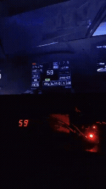
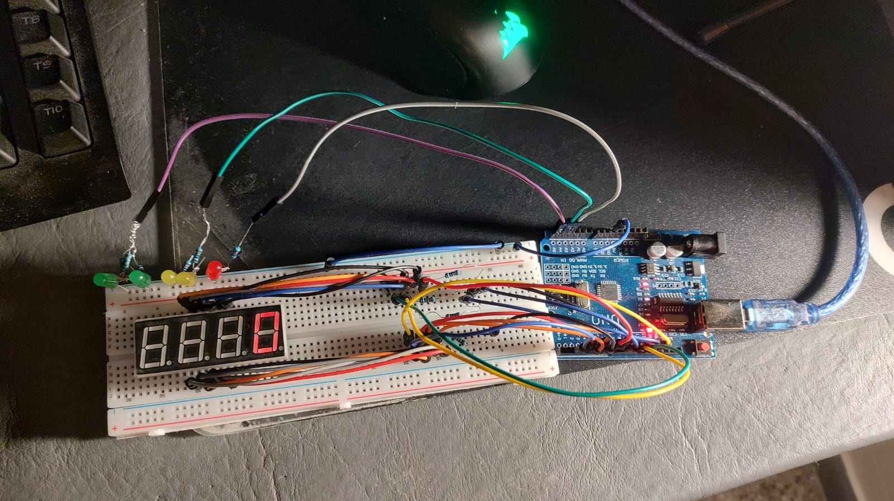
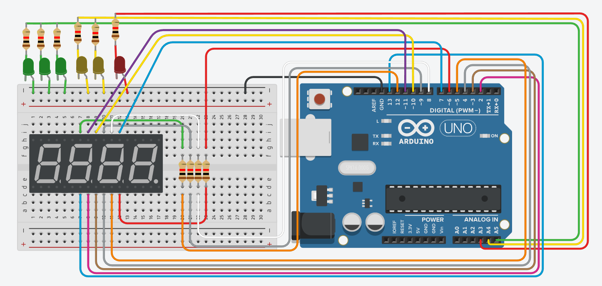
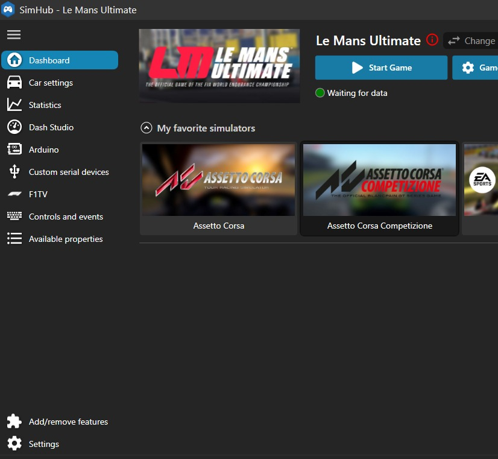
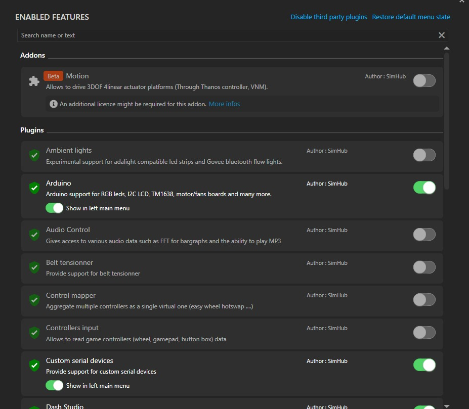
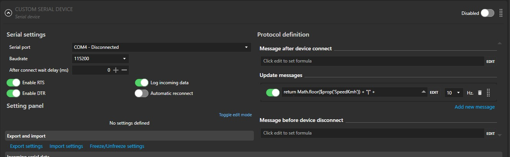
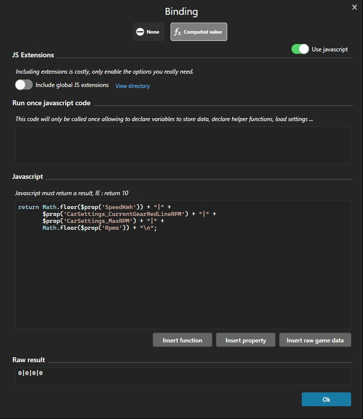

# Arduino Velocimeter for Racing Games

## Demo


## The Circuit

*Note that these are not the best connections*



## Setup
* Firstly, you must have installed [Arduino IDE](https://www.arduino.cc/en/software/) or [Arduino CLI](https://docs.arduino.cc/arduino-cli/installation/) to flash the [script](DisplayLedsSim.ino) to the Arduino
* Secondly, you have to have installed [SimHub](https://www.simhubdash.com/download-2/) for reading racing games data

If you have installed everything needed, proceed with the next section

## Flash Script
To make this work, you have to flash the `.ino` [script inside the repository](DisplayLedsSim.ino) to the Arduino.

## SimHub Config
Now that you have installed SimHub, you must configure it to send data to our Arduino.

### Adding Custom Serial Devices plugin


In the bottom left section called **Add/remove features**, you must enable the next plugins:
* Arduino
* Custom Serial Devices


*Note: you can search the plugins in the top part of the modal*

### Setting up Custom Serial Devicesitems
Now that we have enabled this plugin, a new section in the left should have appeared (if not, restart SimHub). It is called **Custom serial devices**.
Go to it and you should see a menu with a button saying **Add custom serial device**. Click on it.



Something like this should have appeared. Now it's time to setup the communication between our Arduino and SimHub via Serial!

* **Serial Port**: Identify which device is the Arduino (you can plug and unplug it to the pc to see which it is) and select it.
* **Baudrate**: This is ***important***, select the same as me (115200).
* **Messages**: Add a message if there isn't. Select 10 in the *Hz* section. Now, click edit, JavaScript, and put inside it:

```
return Math.floor($prop('SpeedKmh')) + "|" +
       $prop('CarSettings_CurrentGearRedLineRPM') + "|" +
       $prop('CarSettings_MaxRPM') + "|" +
       Math.floor($prop('Rpms')) + "\n";
```
*Note: this only works in **Le Mans Ultimate**, i haven't tried on other games, the variables name may change. You can find it searching in Insert raw game data variables inside edit section.*

It must look something like this:



## Enjoy!
You only have to enable this custom serial device and everything should work (At least in **Le Mans Ultimate**). To having this working you must have opened SimHub to send the data to the Arduino. As the game does not have UDP forwarding, this is the best option i could find.

If you have problems, do not be afraid to ask me!
